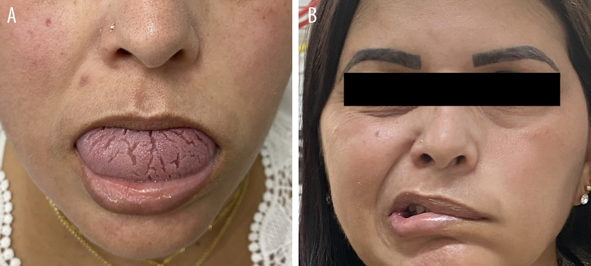

**Cheilitis granulomatosa (CG)**: rare granulomatous disorder, recurrent firm swelling of one or both lips. In isolation, it's called cheilitis granulomatosa of Miescher (CGM).

**Melkersson-Rosenthal syndrome (MRS)**: classical triad of recurrent or persistent orofacial edema, plicated/fissured tongue (lingua plicata), and relapsing peripheral facial nerve paralysis.

* Orofacial granulomatosis: a syndrome grouping noninfectious and nonnecrotizing granulomatous involvement of the lips, oral cavity, and face, it includes CG and MRS, sarcoidosis, and Crohn's disease, although the latter 2 are sometimes excluded to make the classification specific to conditions with no systemic involvement.

The complete triad is uncommon and may be observed in 25% to 33% of patients, even then the symptoms rarely appear simultaneously, and long intervals between the occurrence of paralysis and the first swelling have been reported. The disease evolves by flare-ups, yet permanent edema of the lips, and sometimes of the face, can be observed gradually developing.

Unknown etiology, commonly treated with corticosteroids. 

[Source 1](https://www.ncbi.nlm.nih.gov/books/NBK470396/)

[Source 2](https://dermnetnz.org/topics/orofacial-granulomatosis)

[Image Source](https://www.researchgate.net/figure/Melkersson-Rosenthal-syndrome-presenting-with-A-facial-edema-and-tongue-fissuring-and_fig1_367407730)
